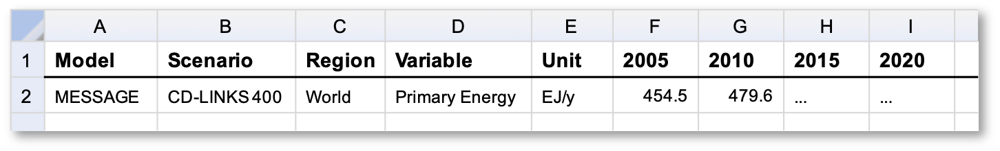

Data Model
==========

Scenario data following the IAMC format
---------------------------------------

.. figure:: _static/iamc_logo.jpg
   :width: 120px
   :align: right

   `IAMC website`_

.. _`IAMC Website`: http://www.globalchange.umd.edu/iamc/

Over the past decade, the Integrated Assessment Modeling Consortium (IAMC)
developed a standardised tabular timeseries format to exchange scenario data.
Previous high-level use cases include reports by the *Intergovernmental Panel
on Climate Change* (`IPCC`_) and model comparison exercises
within the *Energy Modeling Forum* (`EMF`_) hosted by Stanford University.

The table below shows a typical example of integrated-assessment scenario data
following the IAMC format from the `CD-LINKS`_ project.
The |pyam| package is geared for analysis and visualization of any scenario
data provided in this structure.

   Illustrative example of IAMC-format timeseries data |br|
   via the `IAMC 1.5°C Scenario Explorer`_ (:cite:`Huppmann:2019:scenario-data`)

.. _`IAMC 1.5°C Scenario Explorer`: https://data.ene.iiasa.ac.at/iamc-1.5c-explorer

Refer to `data.ene.iiasa.ac.at/database`_ for more information on the
IAMC format and a full list of previous use cases.

.. _`IPCC`: https://www.ipcc.ch

.. _`EMF`: https://emf.stanford.edu

.. _`CD-LINKS`: https://www.cd-links.org

.. _`data.ene.iiasa.ac.at/database`: https://data.ene.iiasa.ac.at/database

The :code:`variable` column
~~~~~~~~~~~~~~~~~~~~~~~~~~~

The :code:`variable` column implements a "semi-hierarchical" structure
using the :code:`|` character (*pipe*, not l or i) to indicate the *depth*.

Semi-hierarchical means that a hierarchy can be imposed, e.g., one can enforce
that the sum of :code:`Emissions|CO2|Energy` and :code:`Emissions|CO2|Other`
must be equal to :code:`Emissions|CO2`
(if there are no other :code:`Emissions|CO2|…` variables).
However, this is not mandatory, e.g., the sum of :code:`Primary Energy|Coal`,
:code:`Primary Energy|Gas` and :code:`Primary Energy|Fossil` should not be equal
to :code:`Primary Energy` because this would double-count fossil fuels.

Refer to the variable list in the documentation pages of the
`IAMC 1.5°C Scenario Explorer`_ to see the full list of variables used in the
recent *IPCC Special Report on Global Warming of 1.5 ºC* (`SR15`_).

.. _`SR15`: https://www.ipcc.ch/sr15/

The :code:`year` column
~~~~~~~~~~~~~~~~~~~~~~~

In its original design, the IAMC data format (see above) assumed that the
temporal dimension of any scenario data was restricted to full years
represented as integer values.

Two additional use cases are currently supported by :class:`pyam` in development
mode (beta):

 - using representative sub-annual timesteps via the :code:`extra_cols` feature
   (see the section on `custom data columns`__)

 - using continuous time via :class:`pandas.datetime`, replacing the name of
   the :code:`year` column by :code:`time`

Please reach out to the developers to get more information on this
ongoing work.

__ extra_cols_

The :class:`IamDataFrame` class
-------------------------------

A :class:`pyam.IamDataFrame` instance is a wrapper for
two :class:`pandas.DataFrame` instances (i.e., tables, read the `pandas docs`_
for more information).

.. _`pandas docs`: https://pandas.pydata.org/pandas-docs/stable/reference/frame.html

The :code:`data` table
~~~~~~~~~~~~~~~~~~~~~~

This table contains the timeseries data related to an ensemble of scenarios.
It is structured in *long format*, where each datapoint is one row. In contrast,
the standard IAMC-style format is in *wide format* (see the example above),
where each timeseries is one row and the timesteps are represented as columns.

While long-format tables have advantages for the internal implementation of many
:class:`pyam` functions, wide-format tables are more intuitive to users.
The method :meth:`timeseries() <pyam.IamDataFrame.timeseries>` converts between
the formats and returns a :class:`pandas.DataFrame` in wide format.
Exporting an :class:`IamDataFrame` to file using
:meth:`to_excel() <pyam.IamDataFrame.to_excel>` or
:meth:`to_csv() <pyam.IamDataFrame.to_csv>` also writes the data table
in wide format.

The standard columns
^^^^^^^^^^^^^^^^^^^^

The columns of the :code:`data` table are :code:`['model', 'scenario', 'region',
'unit', <time_format>, 'value']`, where :code:`time_format` is :code:`year`
when timesteps are given in years (as :class:`int`) or :code:`time` when time
is represented on a continuous scale (as :class:`pandas.datetime`.

.. _extra_cols:

Custom columns of the :code:`data` table
^^^^^^^^^^^^^^^^^^^^^^^^^^^^^^^^^^^^^^^^

If an :class:`IamDataFrame` is initialised with columns that are neither in the
list above nor can be interpreted as time dimension (in wide format), these
columns are included in the :code:`data` table as :code:`extra_cols`.
This feature can be used, for example, to distinguish between multiple stylized
climate model providing different values for the variable
:code:`Temperature|Global Mean` derived from the emissions timeseries of a
scenario.

.. warning::

    Not all :class:`pyam` functions currently support the use with continuous
    time or custom columns of the :code:`data` table. Please reach out via the 
    mailing list or GitHub issues if you are not sure whether your use cases
    is supported.

.. warning::

    A word of warning for adding data-point-specific annotations using custom
    columns: :class:`pyam` drops any data rows which have :code:`NaN` values.
    Hence, if you're adding meta information to :code:`data`, you need to make
    sure that you **add a value to every single row**.

    The reason for that implementation is that pandas does not work as expected
    with :code:`NaN` in many cases
    (see `here <https://stackoverflow.com/a/18431417>`_ and
    `here <https://stackoverflow.com/a/13606221>`_).
    Therefore, it is simpler to remove :code:`NaN`'s to ensure that
    :class:`pyam` has a clean dataset on which to operate.

The :code:`meta` table
~~~~~~~~~~~~~~~~~~~~~~

This table is intended for categorisation and quantitative indicators at the
model-scenario level. Examples in the `SR15`_ context are the warming category 
('Below 1.5°C', '1.5°C with low overshoot', etc.) and the cumulative
CO2 emissions until the end of the century.

:class:`pyam` attempts to keep the information in :code:`meta` consistent with
:code:`data` when performing operations (e.g.,
:meth:`rename() <pyam.IamDataFrame.rename>`,
:meth:`append() <pyam.IamDataFrame.append>`).
See :meth:`utils.merge_meta() <pyam.utils.merge_meta>` for details.

.. note::

    The :code:`meta` table is not intended for annotations of individual
    data points. If you want to add meta information at this level (e.g., 
    which stylized climate model provided the variable
    :code:`Temperature|Global Mean`, or whether a data point is from the 
    original data source or the result of an operation), this should operate on
    the :code:`data` table of the :class:`IamDataFrame` using the
    custom-columns feature (see above).

Filtering
---------

The |pyam| package provides two methods for filtering scenario data:

An existing `class`:IamDataFrame can be filtered using
:meth:`pyam.IamDataFrame.filter(col=...) <pyam.IamDataFrame.filter>`,
where :code:`col` can be any column of the
:code:`data` table (i.e., `['model', 'scenario', 'region', 'unit', 'year']`)
or any column of the :code:`meta` table. The returned object is
a new :class:`pyam.IamDataFrame` instance.

A :class:`pandas.DataFrame` with columns or index :code:`['model', 'scenario']`
can be filtered by any :code:`meta` columns from a :code:`pyam.IamDataFrame`
using :func:`pyam.filter_by_meta(data, df, col=..., join_meta=False) <pyam.filter_by_meta>`.
The returned object is a :class:`pandas.DataFrame` down-selected to those
models-and-scenarios where the :code:`meta` column satisfies the criteria given
by :code:`col=...` .
Optionally, the :code:`meta` columns are joined to the returned dataframe.

References
----------

.. bibliography:: _bib/data.bib
   :style: plain
   :cited:
