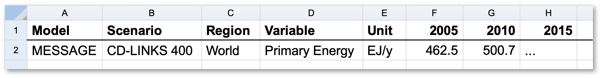

Data Model
==========

Background: The IAMC timeseries scenario data format
----------------------------------------------------

   `IAMC website`_

.. _`IAMC Website`: http://iamconsortium.org/

Over the past decade, the Integrated Assessment Modeling Consortium (IAMC)
developed a standardised tabular timeseries format to exchange scenario data
related to energy systems modelling, land-use change, demand sectors,
and economic indicators in the context of the Sustainable Development Goals.
Previous high-level use cases include reports by the *Intergovernmental Panel
on Climate Change* (`IPCC`_) and model comparison exercises
within the *Energy Modeling Forum* (`EMF`_) hosted by Stanford University.

The table below shows a typical example of integrated-assessment scenario data
following the IAMC format from the Horizon 2020 `CD-LINKS`_ project.
The |pyam| package was initially developed for analysis and visualization
of any scenario data provided in this format.

   Illustrative example of IAMC-format timeseries data |br|
   via the `IAMC 1.5°C Scenario Explorer`_ (:cite:`Huppmann:2019:scenario-data`)

.. _`IAMC 1.5°C Scenario Explorer`: https://data.ece.iiasa.ac.at/iamc-1.5c-explorer

Refer to https://data.ece.iiasa.ac.at/ for a selected list of previous projects
using the IAMC data format.

.. _`IPCC`: https://www.ipcc.ch

.. _`EMF`: https://emf.stanford.edu

.. _`CD-LINKS`: https://www.cd-links.org

The pyam data model
-------------------

A :class:`pyam.IamDataFrame` instance is a container for two types of data:

 - :ref:`data`
 - :ref:`meta`

.. _data:

Scenario timeseries data ('data')
~~~~~~~~~~~~~~~~~~~~~~~~~~~~~~~~~

This attribute holds the timeseries data related to an ensemble of scenarios.
The data follows the format established by the IAMC shown above.
It has the following standard columns (i.e., index dimensions, coordinates):

- model
- scenario
- region
- variable (more info on variables_)
- unit
- year/time (more info on the `temporal domain`_)

When initializing an :class:`IamDataFrame`, the timeseries data can be provided
in *long format*, where each datapoint is one row in a column named 'value',
or it can follow the standard IAMC-style *wide format* (see the example above),
where each timeseries is one row and the timesteps are represented as columns.
Refer to the the `data-table tutorial <tutorials/data_table_formats.ipynb>`_
for more information.

The attribute :attr:`data <pyam.IamDataFrame.data>` returns the timeseries data
in long format as a :class:`pandas.DataFrame`, while
the method :meth:`timeseries() <pyam.IamDataFrame.timeseries>` returns
an indexed :class:`pandas.DataFrame` in wide format.
Exporting an :class:`IamDataFrame` to file using
:meth:`to_excel() <pyam.IamDataFrame.to_excel>` or
:meth:`to_csv() <pyam.IamDataFrame.to_csv>` also writes the data table
in wide format.

.. note::

    If there are :code:`numpy.nan` in a **pandas.DataFrame**
    or empty cells in xlsx/csv files when initializing an **IamDataFrame**,
    it will behave as follows:

    ========= =============================================
    column    behaviour
    ========= =============================================
    'value'   ignore/drop 'nan'
    'unit'    replace 'nan' by an empty string (:code:`''`)
    all other raise an error
    ========= =============================================

    Hence, if you are adding variable/region-specific meta information to
    'data', you need to make sure that you **add a value to every single row**.

    The reason for that implementation is that pandas does not work as expected
    with 'nan' in some situations
    (see `here <https://stackoverflow.com/a/18431417>`_ and
    `here <https://stackoverflow.com/a/13606221>`_).
    Therefore, enforcing that there are no 'nan's in an **IamDataFrame**
    ensures that **pyam** has a clean dataset on which to operate.

.. _variables:

The 'variable' column
^^^^^^^^^^^^^^^^^^^^^

The 'variable' column (or coordinate) describes the type of information represented
in the specific timeseries.
The variable implements a "semi-hierarchical" structure
using the :code:`|` character (*pipe*, not l or i) to indicate the *depth*.
Variable names (should) follow a structure
like :code:`Category|Subcategory|Specification`.

Semi-hierarchical means that a hierarchy can be imposed, e.g., one can enforce
that the sum of :code:`Emissions|CO2|Energy` and :code:`Emissions|CO2|Other`
must be equal to :code:`Emissions|CO2`
(if there are no other :code:`Emissions|CO2|…` variables).

However, this is not mandatory, e.g., the sum of :code:`Primary Energy|Coal`,
:code:`Primary Energy|Gas` and :code:`Primary Energy|Fossil` should not be equal
to :code:`Primary Energy` because this would double-count fossil fuels.

Refer to the variable list in the documentation pages of the
`IAMC 1.5°C Scenario Explorer`_ to see the full list of variables used in the
recent *IPCC Special Report on Global Warming of 1.5 ºC* (`SR15`_).

.. _`SR15`: https://www.ipcc.ch/sr15/

.. _`temporal domain`:

The temporal domain
^^^^^^^^^^^^^^^^^^^

In its original design, the IAMC data format (see above) assumed that the
temporal dimension of any scenario data was restricted to full years
represented as integer values.
In this case, the time index is named 'year'.

Two additional use cases are supported by |pyam|:

- continuous-time timeseries data by using an index named 'time' |br|
  populated by :class:`datetime.datetime` instances
  (replacing the 'year' index)

- representative sub-annual timeslices via the `extra-columns`_ feature

Please reach out to the developers to get more information on this
ongoing work.

.. _`extra-columns`:

Custom *extra-columns* of the 'data' table
^^^^^^^^^^^^^^^^^^^^^^^^^^^^^^^^^^^^^^^^^^

If an :class:`IamDataFrame` is initialised with columns that are not in the
list above nor interpreted as belonging to the time dimension (in wide format),
these columns are included in the 'data' table as custom *extra-columns*.
This feature can be used, for example, to distinguish between multiple
climate models providing different values for the variable
:code:`Temperature|Global Mean`.
It can also be used to describe "representative timeslices", e.g.,
"summer-day", "winter-night", ... by adding an extra-column "subannual".

.. warning::

    Not all **pyam** functions currently support the continuous-time format or
    custom columns in a 'data' table. Please reach out via the 
    `mailing list or GitHub issues`_ if you are not sure whether your use case
    is supported.

.. _`mailing list or GitHub issues`: contributing.html

.. _meta:

Quantitative and qualitative indicators of scenarios ('meta')
~~~~~~~~~~~~~~~~~~~~~~~~~~~~~~~~~~~~~~~~~~~~~~~~~~~~~~~~~~~~~

This attribute is intended for categorisation and quantitative indicators
at the model-scenario level.
Examples in the `SR15`_ context are the warming category
('Below 1.5°C', '1.5°C with low overshoot', etc.) and the cumulative
CO2 emissions until the end of the century.

When performing operations such as :meth:`rename() <pyam.IamDataFrame.rename>`
or :meth:`append() <pyam.IamDataFrame.append>`,
|pyam| attempts to keep the information in 'meta' consistent with
the 'data' dataframe.

.. note::

    The 'meta' table is not intended for annotations of individual
    data points. If you want to add meta information at this level
    (e.g., which stylized climate model provided the variable
    :code:`Temperature|Global Mean`, or whether a data point is from the 
    original data source or the result of an operation), this should operate on
    the 'data' table of the **IamDataFrame** using the
    custom-columns feature (see `extra-columns`_ above).

Filtering
---------

The |pyam| package provides two methods for filtering scenario data:

An existing :class:`IamDataFrame` can be filtered using
:meth:`filter(col=...) <pyam.IamDataFrame.filter>`,
where :code:`col` can be any column of the 'data' table (i.e.,
'model', 'scenario', 'region', 'unit', 'year'/'time' or any `extra-columns`_),
or a column of the 'meta' table. The returned object is
a new :class:`IamDataFrame` instance.

A :class:`pandas.DataFrame` ('data') with columns or index
['model', 'scenario'] can be filtered by any 'meta' columns from
an :class:`IamDataFrame` (:code:`df`) using 
:meth:`pyam.filter_by_meta(data, df, col=..., join_meta=False) <pyam.filter_by_meta>`.
The returned object is a :class:`pandas.DataFrame` down-selected to those
models-and-scenarios where the 'meta' column satisfies the criteria given
by :code:`col=...` .
Optionally, the 'meta' columns are joined to the returned dataframe.
