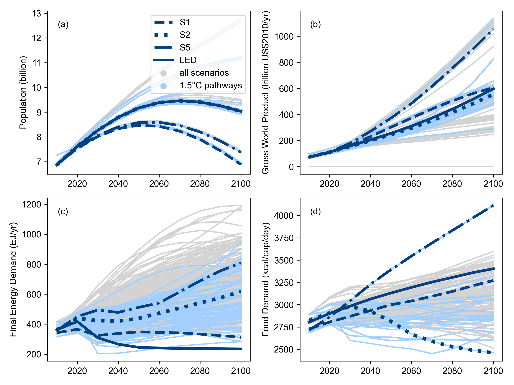

Use cases and applications
==========================

The IPCC Special Report on 1.5°C
--------------------------------

The first high-level use of the pyam package was in the assessment of quantitative,
model-based pathways in the IPCC's *Special Report on Global Warming of 1.5°C* (SR15)
:cite:`Huppmann:2018:NCC`.
Many of the figures, tables and headline statements in the SR15 were implemented
as Jupyter notebooks using an early version of pyam; as illustration,
:numref:`sr15fig24` shows a plot from the SR15 created with pyam methods.
The notebooks were released under an open-source license to increase transparency and
reproducibility of the report :cite:`Huppmann:2018:SR15notebooks`.

.. _sr15fig24:

   Range of assumptions about socio-economic drivers and projections for energy and food demand
   as shown in the IPCC SR15 (Figure 2.4,
   `link <https://www.ipcc.ch/sr15/chapter/chapter-2/2-3/2-3-1/2-3-1-1/figure-2-4/>`_).
   The figure was generated using pyam plotting features
   and the source code was released under an open-source license
   (`source <https://data.ece.iiasa.ac.at/sr15_scenario_analysis/assessment/sr15_2.3.1_range_of_assumptions.html>`_).
   The figure is reproduced per the IPCC's `Copyright policy <https://www.ipcc.ch/copyright/>`_.

The openENTRANCE nomenclature
-----------------------------

The Horizon 2020 project `openENTRANCE <https://openentrance.eu>`_ develops a suite of
open-source models to analyse implications and economic costs associated with
different energy pathways that Europe could take towards its climate goals.
To facilitate the linkage of these models and analyse integrated scenarios,
a common data format and an agreed set of naming conventions and definitions
for regions, variables and units is required.

This "nomenclature" is implemented collaboratively on GitHub
(`repository link <https://github.com/openENTRANCE/nomenclature>`_)
under the open-source Apache 2.0 License. The repository also contains several Python utility
functions to validate the consistency of a scenario with the nomenclature.
These utility functions are built on the pyam package and its versatility
to parse various file formats and data templates.
Moreover, a balance between (human) readability and (machine) processability
was an important consideration when developing the nomenclature.
The common definitions and related validation features will prove useful
beyond the project's scope and can be a cornerstone for future energy model integration.

Model results processing
------------------------

Several open-source modelling frameworks started to use the pyam package
as part of their processing of model results. Three examples are listed here:

 - The `GENeSYS-MOD model <https://git.tu-berlin.de/genesysmod>`_
   :cite:`Hainsch:2020:GENeSYSMOD` is a variation of the widely used OSeMOSYS framework
   for capacity planning and energy systems optimization.
   As part of the model linkage in the openENTRANCE project, the authors implemented
   a processing workflow using pyam to convert model results to the common data format
   used in the project. The workflow for this model is available
   via a `central repository <https://github.com/openENTRANCE/linkages>`_
   storing all model linkage scripts and mappings developed in the openENTRANCE project.

 - The `GUSTO model <https://github.com/sebastianzwickl/GUSTO>`_
   :cite:`Zwickl:2021:GUSTO` for the representation and analysis
   of regional energy communities is based on the **urbs** model.
   The processing of model results is currently being reimplemented to use pyam.

 - The `TEMOA model <https://github.com/TemoaProject/temoa>`_ :cite:`DeCarolis:2016:TEMOA`
   for energy systems analysis includes a prototype implementation to export results
   to a pyam-compatible Excel file as an alternative to its native data format.

Model linkage framework
-----------------------

Ref :cite:`Brinkerink:2021:iam-power-system` implements a soft-linking framework
that supports a workflow between a global integrated-assessment model (IAM)
and a detailed power system model.
The scenario results from the full-economy model can be fed into the power system model
to assess the scenario with enhanced spatial, technological, and temporal resolution.
Results from the power system model can be fed back to the IAM
using an iterative bi-directional soft-linking approach, which
allows for model-informed improvements of the power system representation in the IAM.

This work uses pyam to implement the
`soft-linking method <https://github.com/iiasa/IAM-powersystemmodel-linkage>`_
in a framework-agnostic manner.
Results from any IAM can be used as starting point, as long as they are in a format
compatible with pyam; and with adequate pyam-to-native-format interfaces,
any power system model can be used for the highly-resolved validation and analysis.
This work also uses several pyam features for data input/output, processing
and visualization to streamline the implementation of the soft-linkage method.
