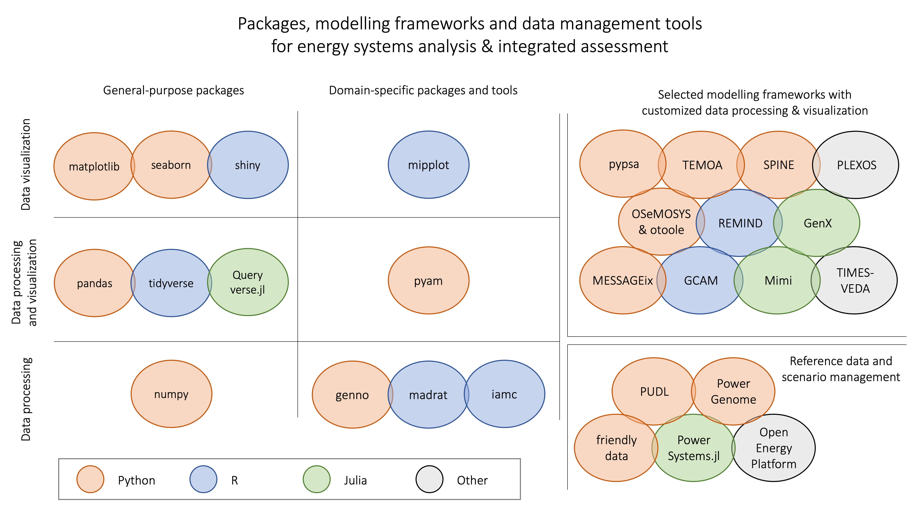

Introduction
============

Towards open-source tools in energy & climate modelling
-------------------------------------------------------

Over the past years, the scientific communities for energy systems modelling and
integrated assessment of climate change mitigation pathways
have made significant strides to "#freethemodels"
:cite:`DeCarolis:2020:macroenergy,Pfenninger:2018:blackbox`.
This includes steps to release input data, assumptions, algebraic formulation,
and processing tools for scenario results under open-source licenses,
in order to facilitate transparency and reproducibility of scientific analysis.
These efforts are part of a larger push towards open science
and FAIR data management principles
(Findable, Accessible, Interoperable, Reusable :cite:`Wilkinson:2016:FAIR`)
supported by stakeholders, funding agencies and researchers themselves,
for example the `openmod initiative <https://openmod-initiative.org>`_.

Alas, the efforts to move to open-source and collaborative (scientific) software
development practices in energy systems modelling, macro-energy research
and integrated assessment have, so far, mostly focused on modelling frameworks
and input data. The processing of scenario results using a common set of tools and
methods has received much less attention.
In many cases, users are either confined to tools for processing of results
that are highly customized to a specific modelling framework,
or they have to develop their own methods and scripts using general-purposes packages.
In a Python environment, for example, users often write their own workflows
and analysis tools from scratch using `pandas <https://pandas.pydata.org>`_,
`numpy <https://numpy.org>`_,
`matplotlib <https://matplotlib.org>`_ :cite:`Hunter:2007:matplotlib`
and `seaborn <https://seaborn.pydata.org>`_ :cite:`Waskom:2021:seaborn`.

The vision of **pyam** is to bridge that gap: to provide a suite of features and methods
that are applicable for scenario processing, analysis and visualization
irrespective of the modelling framework.
At the same time, the package should be sufficiently specific
for energy systems modelling
as well as integrated assessment of climate change and sustainable development
to allow sensible defaults and remove as much clutter as possible from
scenario processing workflows or analysis scripts.
Using a standardized, well-structured toolbox rather than own custom methods
can also reduce the scope for errors and improve the reliability and readability
of scenario processing code.

An overview of existing packages and tools
------------------------------------------

Several open-source packages and tools exist in between the general-purpose packages
for data analysis and plotting, on the one hand, and dedicated data processing solutions
specifically built around a specific modelling framework, on the other hand.

.. _overview:

   Overview of packages & tools for energy system & integrated assessment modelling
   (see the Appendix for a full list of references and links cited in this figure)

The packages on the left-hand side of :numref:`overview` are powerful, general-purpose,
domain-agnostic solutions for data science.
In contrast, in the top-right corner is a selection of several widely used modelling
frameworks that come with dedicated analysis and visualization features "hard-wired"
to their implementation.

In the middle of the figure are several packages and tools that are not customized
to any particular modelling framework, but are geared for broader use in the domain
of energy systems and integrated assessment modelling.
These packages are compatible with a variety of data formats
commonly used by the respective research communities.

The R package `madrat <https://github.com/pik-piam/madrat>`_ provides a framework
for improving reproducibility and transparency in data processing.
It enables the definition and execution of workflows that are frequently nused
in this research domain :cite:`Dietrich:2021:madrat`.
In comparison, the R package `iamc <https://github.com/iamconsortium/iamc>`_ is a collection
of functions for data analysis and diagnostics of scenario results in the IAMC format,
a domain-specific format widely used for climate mitigation scenarios.
(see the following section on data models for more information).
The Python package `genno <https://genno.readthedocs.io>`_ supports describing and
executing complex calculations on labelled, multi-dimensional data; it was developed
as a generalization of data processing in the context of integrated assessment
and transport modelling.

In contrast, the R package `mipplot <https://github.com/UTokyo-mip/mipplot>`_
is a solution for visualization of scenario results related
to climate mitigation :cite:`Yiyi:2021:mipplot`.
It is also based on the IAMC format.

The pyam package, similar to the pandas package in the general-purpose "column"
of the figure, provides features and methods both for data processing as well as for
visualization and plotting. It was developed specifically for supporting workflows
and conducting analysis for input data for and results from energy system models
like those shown in the top-right corner of the figure.

As one additional group of relevant packages for the energy systems modelling domain,
the figure shows several tools for reference data compilation (model input)
and storage of scenario results (model output):

The Public Utility Data Liberation (`PUDL <https://catalyst.coop/pudl>`_) project
takes publicly available information and makes it usable by cleaning, standardizing,
and cross-linking utility data from different sources in a single database.
In a similar effort, `PowerGenome <https://github.com/PowerGenome/PowerGenome>`_
compiles different data sources into a single database.
The `friendly_data <https://github.com/sentinel-energy/friendly_data>`_ package
implements an adaptation to make the frictionless datapackage standard
more easily usable in the energy systems domain.
The `PowerSystems.jl <https://github.com/NREL-SIIP/PowerSystems.jl>`_ package
provides a rigorous data model to enable power systems analysis and modelling
across several input formats.
The `Open Energy Platform <https://openenergy-platform.org>`_ aims to ensure quality,
transparency and reproducibility in energy system research. It is a collaborative
community effort to develop various tools that help working with and sharing
energy-related data across the entire modelling workflow.

These tools are valuable to facilitate the use of consistent data when calibrating
or evaluating models, and they simplify the process to share and compare results
across modelling frameworks.
Alas, these tools still suffer from fragmentation and incompatible data formats.
To integrate them with either a general-purpose data science package or
a specific modelling framework requires substantial effort.

A Python package for scenario analysis & visualization
------------------------------------------------------

We believe that pyam can serve a useful "bridge" between different modelling
frameworks, or between models and various data management solutions.
Due to its wide scope encompassing various aspects of data science and visualization
options, it can be a valuable addition to the to the suite of tools
used by the energy systems and integrated assessment modelling communities.

The pyam package grew out of complementary efforts in the Horizon 2020 project
`CRESCENDO <https://www.crescendoproject.eu>`_ and the analysis of integrated-assessment scenarios
supporting the IPCC's *Special Report on Global Warming of 1.5°C*.
An earlier manuscript describes its features and capabilities at that time
:cite:`Gidden:2019:pyam`.
After more than two years of further development, we believe that the package has now
reached a reasonable level of maturity to be useful to a wider audience -
in scientific-software jargon, it is ready for **release 1.0**.

The aim of the package is not to provide complex new methodologies
or sophisticated plotting features. Instead, the vision is to provide a toolbox
for many small operations and processing steps that a researcher or analyst frequently
needs when working with numerical scenarios of climate change mitigation
and the energy system transition:
aggregation & downscaling, unit conversion, validation,
and a simple plotting library to quickly get an intuition of the scenario data.

The package can be used for results generated from any model in the listed domains above
or related reference sources, if the data does have some sectoral, spatial and temporal
dimension.
While we use the term "timeseries" throughout this manuscript, pyam can handle data
that has only one level of regional and temporal resolution,
e.g., global CO2 emissions in one specific year.

By following the design of `pandas <https://pandas.pydata.org>`_ and other mature,
well-established packages, it can appeal to a broad range of user groups:

- Modelers generating scenario results using their own tools and frameworks,
  as well as researchers and analysts working with existing scenario ensembles
  such as those supporting the IPCC reports or produced in research projects.
- Users that want to add a particular step to an existing scenario processing workflow
  as well as modelers that are starting scenario analysis from scratch.
- Python experts as well as novice users of this programming language.

This manuscript describes the design principles of the package
and the types of data that can be handled.
We present a number of features and recent applications
to illustrate the usefulness of pyam, and we point to the tutorials that
can help potential users to decide whether the pyam package may be suitable for them.
In the last section, we identify several forthcoming uses cases
and planned developments.
