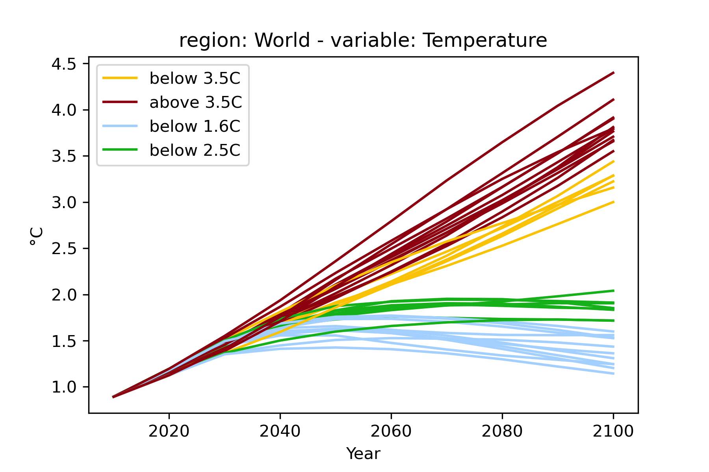

The pyam package
================

Design principles, implementation and user groups
-------------------------------------------------

The vision for the pyam package is to provide a toolbox for many small operations
and processing steps that a researcher or analyst frequently needs when working
with numerical scenarios of climate change mitigation and the energy system transition.
The central paradigm for implementing this aim is to leverage the structure of the data
model (see the following section) for common operations such as unit conversion
or aggregation along sectoral, regional and temporal dimensions.

We see this package as serving two distinct groups:
*experienced Python users* requiring a versatile and powerful solution,
whose natural tendency would be to reimplement
any data processing step directly in a general-purpose data analysis package like
pandas or numpy; and users with *domain expertise but limited Python knowledge*,
who appreciate a simple and intuitive interface.
To make matters even more complicated, it is important to remain aware that users
will always have requirements that cannot be realistically met by any single package.

To reconcile these competing interests, we decided to follow the design of the pandas
package as closely as possible.
First, the pyam package implements functions that mimic pandas
(e.g., :code:`rename()`, :code:`filter()`),
and it uses similar keyword arguments where possible (e.g., :code:`inplace`).
This makes pyam intuitive for experienced users, and it sets Python novices
on a good path when learning more advanced packages later.
Second, the pyam implementation is not a monolith; it is structured so that a user
can easily use the pyam functionality for parts of a processing workflow, then
pull out the internal data objects for more advanced manipulation with pandas or numpy,
and then continue with pyam functions.

To further accommodate the alternative user groups, we implemented several tools
for community engagement: experienced users will find it most convenient to interact
via the GitHub repository;
for users with limited experience in collaborative (scientific) software development,
an email list hosted by `groups.io <https://pyam.groups.io/>`_ and a Slack channel
provide a less daunting avenue to ask questions or suggest new features.

The pyam package follows widely accepted principles of best practice in
scientific software development :cite:`Wilson:2017:goodenough`.
It is released under the open-source APACHE 2.0 license,
and the package is available via both pypi.org and conda-forge.
Comprehensive documentation is rendered on `ReadTheDocs.org 
<https://pyam-iamc.readthedocs.io>`_.

The code base is hosted on GitHub to take advantage of its tools
for version control and collaboration,
and the code follows the `Black style <https://black.readthedocs.io/>`_,
which is the state-of-the-art utility for linting and formatting in Python.
It includes an extensive test suite with coverage >90%,
executed via GitHub Actions on several operating systems and Python versions
for every pull request.
Tests are also executed on a regular basis (weekly or nightly)
to guard against issues caused by dependency updates.

The pyam data model
-------------------

There is an inherent ambiguity about the use of term "scenario" in the community:
it can refer to a "scenario protocol", a set of assumptions or constraints
that define a storyline or pathway;
it can also refer to the implementation of a scenario protocol
in a specific numerical modelling framework, which is then called a "scenario run".

An **IamDataFrame** is a structured collection of numerical implementations of
*scenarios* (i.e., scenario runs).
Each scenario is identified by an *index*; the standard index dimensions are
'model' (the modelling framework) and 'scenario' (i.e., the scenario protocol).
Thus, by design, it is setup to facilitate model/scenario comparison and analysis.

Timeseries data
^^^^^^^^^^^^^^^

Each timeseries data point is identified by the index dimensions of the IamDataFrame,
the *coordinate* columns 'region', 'variable', 'unit', and a temporal coordinate.
The time domain can be yearly data ('year') or a continuous date-time format ('time').
It is also possible to add *extra-columns* when more fine-grained indexing is required.
This feature can be used to describe "representative timeslices"
(e.g., *summer-day*, *peak-hour*),
meaning a non-consecutive temporal disaggregation domain.

The internal handling of timeseries data is implemented in *long format*,
i.e., a pair of columns for the *value* and the time domain in the data table.
Alas, it is often more convenient to display and store timeseries data in *wide format*,
where the temporal dimension is displayed as columns.
The method :code:`timeseries()` returns the data in this format as a **pandas.DataFrame**,
and writing to file (see the section "Supported file formats") applies it, too.

An illustrative example of a 'data' table in a standard IAMC wide format is shown below.
It is taken from the `IAMC 1.5°C Scenario Explorer`_ :cite:`Huppmann:2019:scenario-data`
showing a timeseries data row of a scenario from the `CD-LINKS`_ project.

.. csv-table:: Illustrative example of a timeseries 'data' table in *wide format*
   :header: "model", "scenario", "region", "variable", "unit", 2005, 2010, 2015, "..."

   "MESSAGE", "CD-LINKS 400", "World", "Primary Energy", "EJ/y", 462.5, 500.7, "...", "..."
   "...", "...", "...", "...", "...", "...", "...", "...", "..."

.. _`IAMC 1.5°C scenario explorer`: https://data.ene.iiasa.ac.at/iamc-1.5c-explorer

.. _`CD-LINKS`: https://www.cd-links.org

Quantitative or qualitative meta indicators
^^^^^^^^^^^^^^^^^^^^^^^^^^^^^^^^^^^^^^^^^^^

Each scenario (i.e., scenario run) can have any number of quantitative or qualitative indicators.
The corresponding 'meta' table to the example above is shown here.

.. csv-table:: Illustrative example of a 'meta' table for quantitative or qualitative scenario indicators
   :header: "model", "scenario", "category", "year of peak warming", "cumulative CO2", "..."

   "MESSAGE", "CD-LINKS 400", "1.5C high overshoot", 2051, -17.73, "..."
   "...", "...", "...", "...", "...", "..."

Operation and features
----------------------

The features of the pyam package can by broadly categorized into three groups:
scenario processing, validation, and visualization.

Scenario processing
^^^^^^^^^^^^^^^^^^^

The most important element of integrated assessment and energy systems modelling
apart from the algebraic formulation
is the preparation of input data and assumptions as well as the processing
of numerical results to a state in which they can be conveniently analysed.
The pyam package provides a suite of methods that can facilitate these tasks.
Two of them are presented here as illustration of the general implementation strategy.

Input data and modelling results frequently have to be aggregated or downscaled
along sectoral, spatial or temporal dimensions. The pyam package provides multiple
functions to that effect offering a variety of methods including sum, mean, min and max.
In addition, a weighted-average feature can use proxy-variables
available at the target resolution directly from the timeseries data,
or a weights-dataframe which can be passed as a keyword argument.
This enables a user to compute weighted averages with minimal effort, for example using
population at a national level as a proxy when downscaling regional energy consumption.

.. code-block:: python

    df.downscale_region("Final Energy", proxy="Population")

Alternatively, a user can use a more sophisticated methodology for calculating weights
and use pyam only to apply them to the timeseries data using a keyword argument.
All of these features call the respective pandas functions on the pyam-internal data object
to benefit from the performance and versatility of that package.

For the second illustrative example for data processing,
the pyam package provides a method :code:`convert_unit()`, which uses the
`iam-units <https://github.com/IAMconsortium/units>`_ package
as a dependency to facilitate intuitive operations.
The iam-units package is in turn built on the `pint <https://pint.readthedocs.io>`_ package,
a powerful and versatile solution for defining units and performing arithmetic operations on them.
pint can natively handle all SI definitions and many other widely used units,
and iam-units adds definitions frequently encountered in energy systems,
integrated-assessment and climate modelling.

One example of added functionality by the iam-units package is the conversion of
greenhouse gas emissions to their |CO2|-equivalent
by any of several IPCC Global Warming Potential (GWP) metrics.

.. code-block:: python

    df.convert_unit("Mt CH4/yr", to="Gt CO2e/yr", context="AR5GWP100")

Using this package as a dependency in pyam rather than implementing a parallel solution
follows the best-practice software design principle of "separation of concerns"
and helps to keep the code base as succinct as possible.

Validation
^^^^^^^^^^

An important part of scenario analysis is the validation of data for completeness and
correctness, in particular ensuring that results are close to given reference data
or that the sectoral and spatial aggregations are internally consistent.
The functions implemented for this purpose are :code:`require_variable()`,
:code:`validate()`, and several methods with the pattern :code:`check_*()`.

Per default, all validation functions report which scenarios or which data points
do not satisfy the respective validation criteria. However, each method also has
an option to :code:`exclude_on_fail`, which marks all scenarios failing the validation
as :code:`exclude=True` in the ‘meta’ table (see the 'Data Model' section above).
This feature can be particularly helpful when a user wants to perform a number
of validation steps and then remove or filter all scenarios violating
any of the criteria as part of a scripted workflow.

Visualization
^^^^^^^^^^^^^

Following the structure of pandas and matplotlib, the pyam package provides
direct integration between data manipulation and visualization features.
It implements a range of plotting features using matplotlib and seaborn
such that users can quickly gain a graphical intuition of the data.

Where possible, the package sets reasonable defaults to streamline the workflow.
For example, the simplest possible function call is :code:`df.plot()`
(without any arguments), which draws a line plot using the time domain as the x-axis -
this is arguable the most common use case for scenario data.

The plotting library also supports specifying styles (colors, markers, etc.)
for categories, which can then be used directly as arguments in the plotting methods.
:numref:`figwarming` from the `first-steps tutorial`_
illustrates this feature, where warming categories and respective colors
have been defined as part of the script.

.. _figwarming:

   A simple plot from the `first-steps tutorial`_.
   The plot is created from the code snippet below, the assignment of the
   `warming-category` and the associated colors is shown in the tutorial notebook.

   .. code-block:: python

       df.filter(variable="Temperature").plot(color="warming-category")

The pyam package has implementations of several plot types, with a behavior and
function signatures following the underlying pandas, matplotlib or seaborn methods.
Visit the `gallery`_ and read the comprehensive `plotting documentation`_
for an up-to-date overview!

Last, but not least: by being based on the standard Python plotting libraries
matplotlib and seaborn, the pyam plotting functions can be used directly
in any more elaborate figure drawn with these packages.

.. code-block:: python

    import pyam
    import matplotlib.pyplot as plt

    df = pyam.IamDataFrame(...)

    fig, ax = plt.subplots()
    df.plot(ax=ax)  # using pyam features to plot data

    ...  # any other matplotlib features to enhance the figure

    fig.show()

.. _`first-steps tutorial` : https://pyam-iamc.readthedocs.io/en/stable/tutorials/pyam_first_steps.html

.. _`gallery` : https://pyam-iamc.readthedocs.io/en/stable/gallery/index.html

.. _`plotting documentation` : https://pyam-iamc.readthedocs.io/en/stable/api/plotting.html

Supported file formats and data types
-------------------------------------

At the current stage, pyam supports reading from and writing to xlsx and csv files
as well as the `frictionless datapackage <https://frictionlessdata.io>`_ format.
An IamDataFrame can also be initialized from a pandas.DataFrame,
so any pandas-compatible format is also implicitly supported by pyam.
When initializing an IamDataFrame from a pandas DataFrame or reading from file,
pyam will automatically try to cast wide and long table layouts to the expected format.
It is also possible to pass missing columns as keyword arguments;
see the `tutorial on data table formats`_ for details.

.. _`tutorial on data table formats` : https://pyam-iamc.readthedocs.io/en/stable/tutorials/data_table_formats.html

Integration with data resources
-------------------------------

To facilitate using external data resources as input data or for validation and plotting
of scenario results, pyam supports reading data directly from several databases:

- Any **IIASA Scenario Explorer** instance via the native pyam.iiasa module -
  see the related `tutorial`_
  for details.
  Visit https://data.ece.iiasa.ac.at for a list of project databases hosted by IIASA.

- The **World Bank Development Indicator** database via
  the `pandas-datareader <https://pandas-datareader.readthedocs.io>`_ package.

- The **UNFCCC Data Inventory** via
  the `unfccc-di-api <https://unfccc-di-api.readthedocs.io>`_ package
  :cite:`Pflueger:2021:unfccc`.

Refer to the `documentation`_ of all functions to query data resources.

.. _`tutorial` : https://pyam-iamc.readthedocs.io/en/stable/tutorials/iiasa_dbs.html

.. _`documentation` : https://pyam-iamc.readthedocs.io/en/stable/api/database.html

.. |CO2| replace:: CO\ :sub:`2`\
