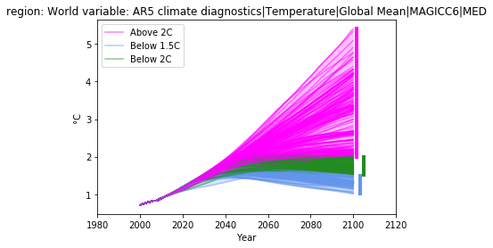
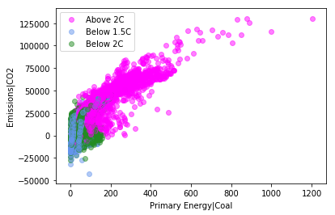

# Summary

Quantitative model-based scenarios of the human and earth systems
play a critical role in the scientific analysis of climate change mitigation
options and sustainable development policies.
Perhaps the most visible among these projects is the assessment of pathways
from Integrated Assessment Models (IAM) and other numerical frameworks by
the Intergovernmental Panel on Climate Change (IPCC) in its periodical reports.
For the recent *Special Report on Global Warming of 1.5 °C*
([SR15](http://www.ipcc.ch/report/sr15/), [@rogelj_global_nodate]),
a scenario ensemble underpinning the quantitative assessment was compiled
and released to facilitate transparency of the assessment and replicability
of the findings in the report [@huppmann_ncc_2018].

Additionally, IAM scenarios [@riahi_shared_2017] serve as one of the main
drivers of the Coupled Model Intercomparison Project Phase 6
[(CMIP6)](https://www.wcrp-climate.org/wgcm-cmip/wgcm-cmip6)
[@oneill_scenario_2016; @gidden_global_2018], which informs the global
scientific basis for climate change. IAMs are not only limited to global
analyses, but also are critical for country-specific policy assessments both
domestically as well as in the global context [@rogelj_paris_2016]. While great
strides have been made to make IAM scenario data publicly available among these
different projects, limited effort has been applied so far to develop open tools
for their exploration, analysis, and visualization.

Here we present a new tool which aims to fill the current gaps in the IAM
toolbox: an open-source analysis and visualization library named __pyam__
[@pyam_2018]. __pyam__ has been designed since its inception following known
best practices in scientific software development, including automatic
documentation, unit testing, and continuous integration. At its core, __pyam__
is a tool that enables researchers to easily explore, categorize, and
visualize scenario data such as the scenario ensembles assessed by the IPCC.
Such exploration is enabled via a __pandas.DataFrame__-style interface using a
composition design pattern while maintaining sidecar metadata in a single
__pyam.IamDataFrame__ object. 

Critically, __pyam__ provides a common mechanism by which scenario data analysis
is performed. This allows to easily share such analysis for greater transparency
and reproducibility, through, e.g., Jupyter notebooks. In fact, it is already an
integral tool used by scientists leading the data analysis of both the IPCC
SR15 as well as the ScenarioMIP contribution to CMIP6. The Jupyter notebooks
generating the categorization and assessment in the SR15, including figures and
tables printed in the report, are based on __pyam__ and have been publicly
released under an open-source license [@huppmann_notebooks_2018].

A large suite of examples is available via the __pyam__
[website](https://data.ene.iiasa.ac.at/software/pyam/). Here, we provide a small
vignette below for interacting with and visualizing the recent SR15 dataset.


```python
import pyam

# read all data for three variables at the global ('World') level
# from the *IAMC 1.5 °C Scenario Data*, the database underpinning the IPCC SR15
df = pyam.read_iiasa_iamc15(
    model='*', scenario='*',
    variable=['Emissions|CO2', 'Primary Energy|Coal', 
              'AR5 climate diagnostics|Temperature|Global Mean|MAGICC6|MED'], 
    region='World'
)

# Categorize these data by their Global Mean Temperature values in 2100
df.categorize(
    'Temperature', 'Below 1.5C',
    criteria={'AR5 climate diagnostics|Temperature|Global Mean|MAGICC6|MED': 
             {'up': 1.5, 'year': 2100}},
    color='cornflowerblue'
)

df.categorize(
    'Temperature', 'Below 2C',
    criteria={'AR5 climate diagnostics|Temperature|Global Mean|MAGICC6|MED': 
             {'lo': 1.5, 'up': 2, 'year': 2100}},
    color='forestgreen'
)

df.categorize(
    'Temperature', 'Above 2C',
    criteria={'AR5 climate diagnostics|Temperature|Global Mean|MAGICC6|MED': 
             {'lo': 2, 'year': 2100}},
    color='magenta'
)

# Temperature data can be plotted directly based on these categories,
# shading areas between lowest and highest values for each category,
# and providing minimum/maximum ranges of final-year data
(df
 .filter(variable='*Temperature*')
 .line_plot(color='Temperature', legend=True, 
            alpha=0.5, fill_between=True, 
            final_ranges=dict(linewidth=4))
)

# Separately, the other data can be plotted using the temperatue categories.
(df
 .filter(region='World')
 .scatter(x='Primary Energy|Coal', y='Emissions|CO2', 
          color='Temperature', alpha=0.5, legend=True)
)
```

Executing the above code snippet results in the following figures. 





The __pyam__ user community already spans three continents and multiple
scientific domains. New features, e.g., integration with simple climate models,
are envisioned for future releases in order to further expand the usability and
relevance of the tool. By standardizing analysis and visualization work flows in
assessment modeling, modelers can more keenly focus on their core competency:
developing and performing large-scale models of the interlinked human,
environment, and climate systems.

# Acknowledgments

This project has received funding from the European Union’s Horizon 2020
research and innovation programme under grant agreement No 641816 (CRESCENDO)
for visualization development. We acknowledge further funding by the European
Union’s Horizon 2020 research and innovation programme under grant agreement
no. 642147 (‘CD-LINKS’ project) supporting aspects of IPCC analysis.

# References
